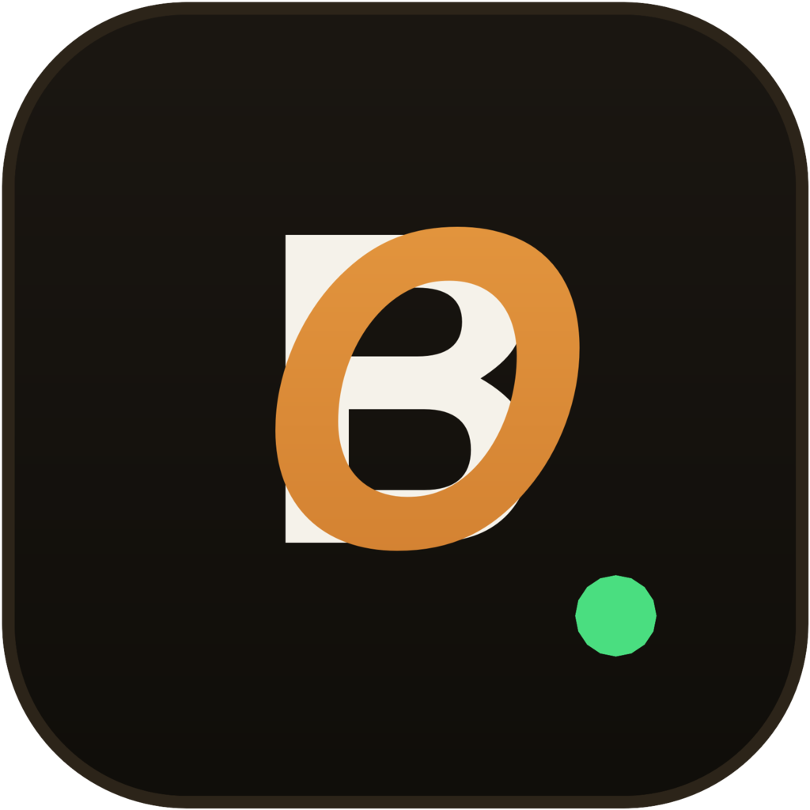

<p align="center">
  
</p>

# BannerOps

A lightweight admin panel for Mount & Blade II: Bannerlord dedicated servers that you host yourself.

If you run a Bannerlord server, managing players means alt-tabbing to a console window and typing commands by hand. BannerOps puts all of that in a clean web interface you open in your browser.

## What it does

- See who's connected in real time, with ping and score, and kick or ban anyone in one click
- Build and reorder your map rotation, and switch game modes without restarting the server
- Watch the server console live and run any admin command straight from the browser
- Everything runs on your own machine, so your player data and passwords never leave it
- One command to install, works on both Windows and Linux

## Install

BannerOps is delivered as a zip archive. Extract it, then run the `bo` command:

```
unzip BannerOps.zip -d bannerops
cd bannerops
./bo --config /path/to/your/server-config.txt
```

On Windows, extract the zip and run `bo.exe` instead. Then open http://localhost:8088 in your browser.

Grab a license at https://bannerops.net

## Community

Got a question or found a bug? Come say hi on Discord: https://discord.gg/kFxkTCmx9E

## License

BannerOps is proprietary software. See the LICENSE file for the details. Copyright 2026 BannerOps.
